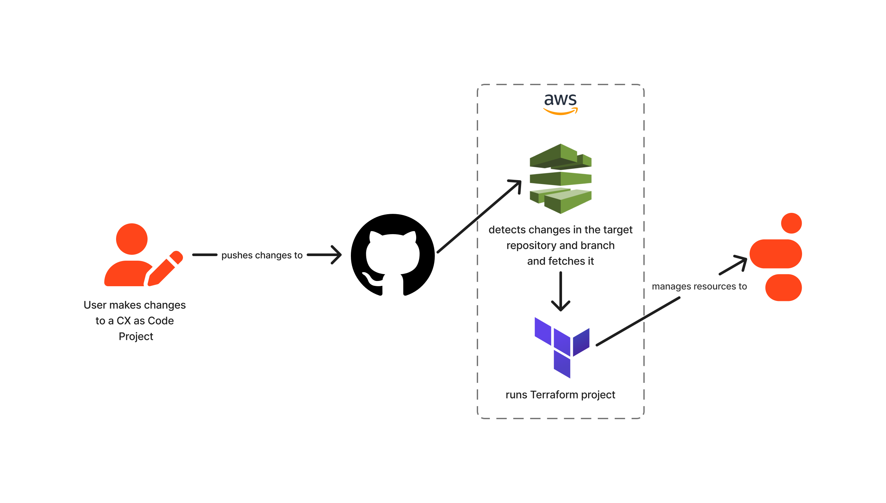

# Deploy CX as Code from GitHub with AWS Pipeline

This Genesys Cloud Developer Blueprint provides an AWS CDK template with AWS Pipeline that automatically deploys your CX as Code project whenever there is a push on a targeted branch.

You can [read the documentation here](blueprint/index.md).
