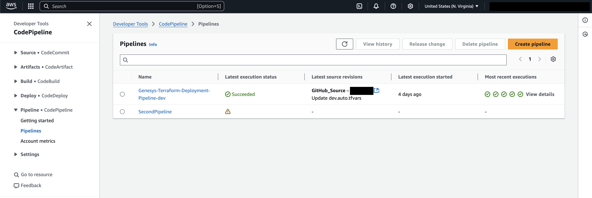
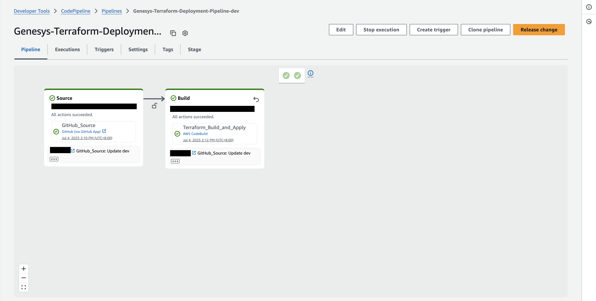
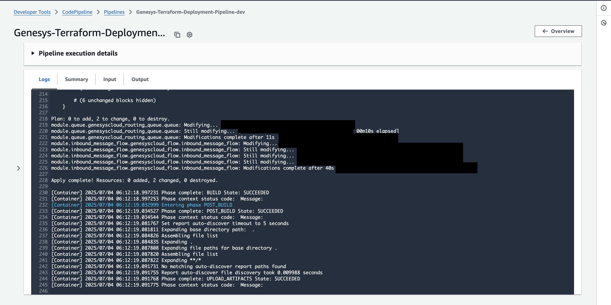

With Terraform as the base for Infrastructure-as-a-Code for CX as Code, you have the flexibility on how to implement your CI/CD pipelines to deploy your latest changes with Genesys Cloud Resources. One way for you to implement this is with AWS CodePipeline and GitHub. The CX as Code project is stored in a GitHub repository, and for every push in a targeted branch, AWS CodePipeline will start a deployment flow that will run the CX as Code project and deploy the changes to a targeted Genesys Cloud Organization. This implementation allows an immediate deployment of changes and removes the dependency of running the CX as Code project manually from a local machine. Plus, an access to a suite of AWS services that can improve and streamline your CI/CD pipeline.


## Solution Components

- **CX as Code** - a Genesys Cloud Terraform provider that provides an interface for declaring core Genesys Cloud objects.
- **GitHub** - a web-based platform that uses Git for version control and collaboration. It allows developers to store, manage, and share their code, making it a popular choice for both open-source projects and internal team collaboration.
- **Amazon Web Service** - a comprehensive cloud computing platform offered by Amazon. It provides a wide array of services like computing power, storage, databases, and more, allowing businesses to run applications and store data without needing to manage their own physical infrastructure.
  - **AWS CodePipeline** - a continuous delivery service you can use to model, visualize, and automate the steps required to release your software.
  - **AWS CodeBuild** - a continuous integration service that compiles source code, runs tests, and produces software packages that are ready to deploy.
  - **AWS S3** - a cloud-based object storage service of AWS. This is where AWS stores the `.tfstate` file generated by Terraform and the artifacts created by the AWS CodePipeline.
  - **AWS Secrets Manager** - helps protect access to your applications, services, and IT resources by enabling you to securely store, manage, and retrieve secrets throughout their lifecycle.
  - **AWS Cloud Development Kit** - known as AWS CDK, is an open-source software development framework for defining cloud infrastructure in code and provisioning it through AWS CloudFormation. Supports multiple programming languages from TypeScript, JavaScript, Python, etc.
- **NodeJS** - an open-source, cross-platform JavaScript runtime environment that allows developers to execute JavaScript code outside of a web browser. This is the framework used to utilize AWS CDK.

## Prerequisites

- Specialized Knowledge
  - Administrator-level knowledge of Genesys Cloud.
  - Basic knowledge of the Genesys Cloud API.
  - Basic knowledge of Terraform.
  - Basic knowledge of CX as Code.
  - Basic knowledge of AWS.
  - Familiar with NodeJS and Typescript/Javascipt.
- Genesys Account Requirements
  - A Genesys Cloud license. For more information, see [Genesys Cloud Pricing](https://www.genesys.com/pricing "Goes to the Genesys Cloud Pricing page").
  - Master Admin role in Genesys Cloud. For more information, see [Roles and permissions overview](https://help.mypurecloud.com/?p=24360 "Goes to the roles and permissions overview in the Genesys Cloud Resource Center") in the Genesys Cloud Resource Center.
  - [OAuth Client](https://help.mypurecloud.com/articles/create-an-oauth-client/ "Goes to the Create an OAuth Client article") with the Master Admin role.
- GitHub Account Requirements
  - Admin-level permissions in the target repository.
- AWS Account Requirements
  - Admin account or a minimum admin-level roles and/or permissions to the following services:
    - AWS CodePipeline
    - AWS CodeBuild
    - AWS S3
    - AWS Secrets Manager

## Implementation Steps

- [Preparation Steps](#preparation-steps "Goes to the Preparation Steps section")
    1. [Install dependencies](#install-dependencies "Goes to the Install dependencies step")
    2. [Clone the repository](#clone-the-repository "Goes to the Clone the repository step")
    3. [Create an OAuth Client](#create-an-oauth-client "Goes to the Create an OAuth Client step")
    4. [Preparing your CX as Code Project](#preparing-your-cx-as-code-project "Goes to the Preparing your CX as Code Project step")
    5. [Create a GitHub Code Connection for AWS](#create-a-github-code-connection-for-aws "Goes to the Create a GitHub Code Connection for AWS step")
    6. [Creating your Secret in Secrets Manager](#creating-your-secret-in-secrets-manager "Creating your Secret in Secrets Manager step")
- [AWS CDK Deployment](#aws-cdk-deployment "Goes to the AWS CDK Deployment section")
    1. [Configuring the CDK](#configuring-the-cdk "Goes to the Configuring the CDK step")
    2. [Deploying the CDK](#deploying-the-cdk "Goes to the Deploying the CDK step")
- [Checking and Testing](#checking-and-testing "Goes to the Checking and Testing step")

## Preparation Steps

### Install dependencies

The blueprint requires the installation of the following:

- [NodeJS](https://nodejs.org/ "Goes to the NodeJS website") - ideally the latest LTS, version used for this blueprint is NodeJS 23. If you will use older versions, be cautious of any code conflicts.
- [AWS CLI](https://docs.aws.amazon.com/cli/latest/userguide/getting-started-install.html "Goes to the installation instructions of AWS CLI in AWS User Guide")
- [AWS CDK](https://docs.aws.amazon.com/cdk/v2/guide/getting-started.html#getting-started-prerequisites "Goes to the installation instructions of AWS CDK in AWS Developer Guide")
- [Terraform](https://developer.hashicorp.com/terraform/install "Goes to the installations instructions of Terraform") - _(Optional)_ for the development of your CX as Code project locally.

### Clone the repository

Clone the [aws-pipeline-cx-as-code-blueprint](https://github.com/GenesysCloudBlueprints/aws-pipeline-cx-as-code-blueprint "Goes to the aws-pipeline-cx-as-code-blueprint repository in GitHub") repository in your local machine. You can also run this git command to clone the repository:

```bash
git clone https://github.com/GenesysCloudBlueprints/aws-pipeline-cx-as-code-blueprint.git
```

### Create an OAuth Client

The use of an OAuth Client is required for Terraform to create your Genesys Cloud resources. Instructions on how to create one is in this [article](https://help.mypurecloud.com/articles/create-an-oauth-client/ "Goes to create an OAuth Client in Genesys Cloud Resource Center"). Do take note of both the generated `Client ID` and `Client Secret`.

### Preparing your CX as Code Project

If you don't have an existing CX as Code project, the repository has provided a basic example that deploys a simple inbound message flow. You can fork the repository which the AWS CodePipeline will fetch.

You will need to modify some specific values in the `dev.auto.tfvars`. The file looks like this:

```text
# Provide the values for the variables used in the Terraform configuration.
# This file is used to provide the values for the variables defined in the main.tf and other module files.
email    = "useremail@genesys.com"
division = "your-division-name"

# Resource Names
bot_flow_name                    = "AWS Pipeline Basic Email Bot Flow"
queue_name                       = "AWS Pipeline Test Queue"
inbound_message_flow_name        = "AWS Pipeline Inbound Message Flow"
web_messenger_configuration_name = "AWS Pipeline Web Messenger Configuration"
web_messenger_deployment_name    = "AWS Pipeline Web Messenger Deployment"
```

If you have an existing CX as Code project, ensure that it is saved in a GitHub repository and add a `buildspec.yml` in your root directory that looks like this:

```yml
version: 0.2
phases:
  install:
    commands:
      - sudo yum install -y yum-utils
      - sudo yum-config-manager --add-repo https://rpm.releases.hashicorp.com/AmazonLinux/hashicorp.repo
      - sudo yum -y install terraform
  pre_build:
    commands:
      - terraform init -backend-config="bucket=$TF_STATE_BUCKET" -backend-config="key=genesys/terraform.tfstate" -backend-config="region=$AWS_DEFAULT_REGION"
      - terraform plan
  build:
    commands:
      - terraform apply -auto-approve
```

This file is also included in the repository.

The `buildspec.yml` file is an instructions file that tells on what AWS CodeBuild will do with the retrieved repository. This is where we can instruct the machine to initialize its dependencies and run the Terraform project to deploy your Genesys Cloud resources. You can further customize the YAML file depending on your project's needs.

### Create a GitHub Code Connection for AWS

To allow your AWS account to connect with your GitHub repository you must create a GitHub Code Connection. You have to login to your AWS Console and [instructions to create one is in this article](https://docs.aws.amazon.com/codepipeline/latest/userguide/connections-github.html "Goes to the GitHub Connections article in AWS CodePipeline User Guide"). Once created, ensure that the code connection has a permission to access your target repository and take note of the ARN generated.

### Creating your Secret in Secrets Manager

We need to store our secrets (in this case the OAuth Client Credentials) securely for AWS' use with Secrets Manager. We can create one via AWS Console.

1. Login to your AWS Console and go to **Secrets Manager**.
2. Click **Store a new secret**.
3. Choose **Other type of secret** type.
4. On the **Key/value pairs**, put your Genesys Client ID and Client Secret with the key `GENESYSCLOUD_OAUTHCLIENT_ID` and `GENESYSCLOUD_OAUTHCLIENT_SECRET` respectively. You may also add your other secrets that you might need to run your Terraform project properly. You may also configure the encryption key for the secret. Once done, click **Next**.
5. For steps 2 and 3, fill up or configure other details like the **Secret Name**, description, tags, etc. according to your preference.
6. Review provided details in step 4, and once reviewed, click **Store**.

Once created, do take note of the Secret Name and the keys you created in the secret.

You can also create your secret via [AWS CLI](https://docs.aws.amazon.com/secretsmanager/latest/userguide/create_secret.html#create_secret_cli "Goes to the Create an AWS Secrets Manager secret in AWS User Guide").

## AWS CDK Deployment

### Configuring the CDK

1. Go to the `aws` folder of the [blueprint repository](#clone-the-repository "Goes to the Clone the Repository step").
2. Initialize the project with the command `npm install` to install the NodeJS project's modules and dependencies.
3. Modify the following files to fill in important details:

#### cdk.json

Fill out the details in the object `context` at the end. The details that you need fill looks like this:

```json
{
  "infrastrucureRepoName": "your-repo-name",
  "infrastrucureRepoOwner": "your-github-username OR your-github-org",
  "codeConnectionArn": "your-codeconnection-arn",
  "genesysClientSecretName": "your-aws-secret-name",
  "genesysRegion": "your-genesys-organization-region",
  "dev": {
    "environment": "dev",
    "githubBranch": "dev"
  },
  "prod": {
    "environment": "prod",
    "githubBranch": "prod"
  }
}
```

The `dev` and `prod` objects correspond to environment-specific details. The first two properties are the `environment` which is also used as an affix to AWS and Genesys Cloud resources, and the `githubBranch` which determines what branch to monitor for a given deployed pipeline. You may edit the existing ones or add more environments for your use case.

You may also add other context (eg. terraform variable values, other secrets) for your use case.

#### bin/aws.ts

Once you have set your context values in `cdk.json`, if you have additional context, you will need to adjust `aws.ts` to fetch your values for use in creating your CloudFormation stack. You will see in there codes that have the format of `const someVarible = app.node.tryGetContext("theContextYouWantToGet");`.

You will also need to add those context in the `GenesysTerraformPipelineStackProps` that you also need to update which is located in `lib/genesys-terraform-pipeline-stack.ts`.

In addition, you have to update the environments list based on what you have set up.

#### lib/genesys-terraform-pipeline-stack.ts

If you have added additional context, you will need to adjust the `GenesysTerraformPipelineStackProps`.

You will also need to integrate your additional context (if you need those values for your Terraform project) as an environment variable in the `environmentVariables` section of the CodeBuild project. The snippet looks like this:

```javascript
const project = new codebuild.PipelineProject(this, "TerraformBuild", {
  projectName: `GenesysTerraformBuild-${props.environment}`,
  description: "Build project to run Terraform scripts for Genesys Cloud",
  environment: {
    buildImage: codebuild.LinuxArmBuildImage.AMAZON_LINUX_2023_STANDARD_3_0,
  },
  buildSpec: codebuild.BuildSpec.fromSourceFilename("buildspec.yml"),
  environmentVariables: {
    // You may also add your other values in the secret by following this format:
    GENESYSCLOUD_OAUTHCLIENT_ID: {
      type: codebuild.BuildEnvironmentVariableType.SECRETS_MANAGER,
      value: `${props.genesysClientSecretName}:GENESYSCLOUD_OAUTHCLIENT_ID`,
    },
    GENESYSCLOUD_OAUTHCLIENT_SECRET: {
      type: codebuild.BuildEnvironmentVariableType.SECRETS_MANAGER,
      value: `${props.genesysClientSecretName}:GENESYSCLOUD_OAUTHCLIENT_SECRET`,
    },
    GENESYSCLOUD_REGION: { value: props.genesysRegion },
    // Environment variables for the Terraform project.
    // You may also set/add the other variables here rather than utilizing the .tfvars file.
    TF_VAR_environment_name: { value: props.environment },
    // Environment variables for the buildspec.yml
    TF_STATE_BUCKET: { value: stateBucket.bucketName },
    AWS_DEFAULT_REGION: { value: this.region },
  },
});
```

### Deploying the CDK

Once you have everything set up, we can now deploy the CloudFormation stack to your AWS Account. You can do this by entering the following commands:

```bash
cdk bootstrap --profile your-aws-profile --context env=your-target-env
cdk deploy --profile your-aws-profile --context env=your-target-env
```

The terminal will then confirm the AWS resources that the CDK will create. You can review it and once done, enter `y` to confirm.

## Checking and Testing

Once deployed, you can then inspect the AWS CodePipeline page in the AWS Console. You will see your created pipeline in the list.



Opening it will see the pipeline process. You can see the stages `Source` where it retrieves the repository from GitHub, and the `Build` stage where AWS CodeBuild preps the machine and runs the CX as Code project and deploy the resources to your Genesys Cloud organization.



You can also see the logs of the machine, detailing how did it initialize and apply the Terraform project.



You can then check and test your Genesys organization for the deployed resources.

## Additional Resources

- [Introducing CX as Code](/blog/2021-04-16-cx-as-code/ "Goes to the Introducing CX as Code blog by John Carnell in the Genesys Cloud Developer Center")
- [Genesys Cloud Provider](https://registry.terraform.io/providers/MyPureCloud/genesyscloud/latest/docs "Goes to the Genesys Cloud Provider Documentation in Terraform Registry") Documentation
- [AWS GitHub Connections](https://docs.aws.amazon.com/codepipeline/latest/userguide/connections-github.html "Goes to the GitHub connections article in AWS") Documentation
- [AWS CodePipeline](https://docs.aws.amazon.com/codepipeline/ "Goes to the AWS CodePipeline Documentation in AWS") Documentation
- [AWS CDK](https://docs.aws.amazon.com/cdk/v2/guide/home.html "Goes to the AWS CDK Developer Guide in AWS") Developer Guide
- [Create AWS Secrets Manager Secret](https://docs.aws.amazon.com/secretsmanager/latest/userguide/create_secret.html "Goes to the Create an AWS Secrets Manager secret in AWS User Guide") article
